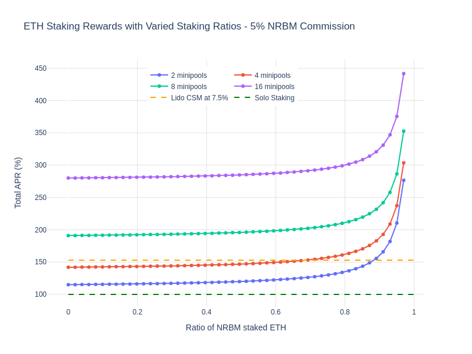

# No RPL Bonded Minipools

This document examines the integration of No RPL Bonded Minipools (NRBMs) into the Rocket Pool ecosystem, focusing on their potential impact and viability without overhauling the existing minipool system. The approach mirrors Lido's use of stETH as collateral and aims to boost Rocket Pool's efficiency and competitiveness. The analysis covers commission structures, their effects on APR for rETH holders, effective RPL stakers, and Node Operators (NOs), and the broader network implications. The proposal aims to attract more NOs, provide competitive rewards, and balance traditional and NRBM staking, promoting a diverse and robust staking environment.

## Idea

- Itruoduction of a new minipool type which only require ETH collateral but no RPL bond for slightly redued rewards.
- Prevent burns that reward unstaked RPL, ensuring rewards are limited to active minipool contributors.
- Increase rewards for traditionalr Rocket Pool stakers with effectively staked RPL.
- Enhance the rETH APR.
- Maintain the existing system, bonding minipools with RPL, to stabilize the network and capitalize on the recent RPIP-30 protocol alignment benefits.

The protocol enables NOs to initiate No RPL Bonded Minipools (NRBMs), redirecting a portion of the rETH commission to a pool akin to the smoothing pool. This pool then allocates rewards to actively staked RPL holders.

(Note: The specified commission rates are illustrative and not finalized. All reward calculations exclude RPL rewards for NOs)

| Option   | NO Commission | NRBM NO         | rETH Holders | eff. RPL Stakers | Notes |
| -------- | ------------- | --------------- | ------------ | ---------------- | ----- |
| 1        | 13%           | 8%              | -13%         | 5%               | Compete with Lido on NRBM commission for NO    |

| Option   | NO Commission | NRBM NO         | rETH Holders | eff. RPL Stakers | Notes |
| -------- | ------------- | --------------- | ------------ | ---------------- | ----- |
| 2        | 10%           | 5%              | -10%         | 5%               | Compete with Lido on rETH APR     |

| Option   | NO Commission | NRBM NO         | rETH Holders | eff. RPL Stakers | Notes |
| -------- | ------------- | --------------- | ------------ | ---------------- | ----- |
| 3        | 12%           | 7%              | -12%         | 5%               | A mixture from the above     |

### Option 1 - Improvement for Solo Stakers
| # minipools | without NRBMs APR | with NRBMs APR (at 8% rETH commission) | Difference |
| ----------- | ----------------- | -------------- | -----------|
| 2    `2*16ETH`       | 100% | 108%      | 8%  |
| 4    `4*8ETH`        | 100% | 124%      | 24% | 
| 8    `8*4ETH`        | 100% | ca. 156%  | 46% |
| 16   `16*2ETH`       | 100% | ca. 220%  | 120% |

### Option 2 - Improvement for Solo Stakers
| # minipools | without NRBMs APR | with NRBMs APR (at 5% rETH commission) | Difference |
| ----------- | ----------------- | -------------- | -----------|
| 2    `2*16ETH`       | 100% | 105%      | 5%  |
| 4    `4*8ETH`        | 100% | 115%      | 15% | 
| 8    `8*4ETH`        | 100% | ca. 135%  | 35% |
| 16   `16*2ETH`       | 100% | ca. 175%  | 75% |

### Option 2 - Improvement for RPL bonded Minipool Stakers
| # minipools | without NRBMs APR | with NRBMs APR | Difference |
| ----------- | ----------------- | -------------- | -----------|
| 2    `2*16ETH`       | 115% | 120%      | 5%  |
| 4    `4*8ETH`        | 142% | 157%      | 15% | 
| 8    `8*4ETH`        | 191% | ca. 226%  | 35% |
| 16   `16*2ETH`       | 280% | ca. 355%  | 58% |

### Additional Protocol Benefits
- NOs utilizing NRBMs gain enhanced rewards compared to solo stakers, benefiting from community support and additional features, potentially including complimentary DVT.
- This model attracts a distinct segment of NOs who, while not engaging with RPL, seek to leverage Rocket Pool's advantages, accepting a marginally lower APR.
- Exposure to the system's robustness, community ethos, and perks may encourage these new NOs to eventually transition to conventional minipools.

### Additional Considerations
- Should Rocket Pool attain 22% of all staked ETH, it could promote traditional RPL-bonded minipools by adjusting rewards: reducing those for NRBMs and enhancing for RPL-backed pools. Additionally, traditional minipools could be prioritized in creation queues.
- The Nodeset model offers a balanced option, presenting a middle ground between NRBM and traditional minipools, with potentially higher rewards than NRBM but more associated risks, and lower rewards but less risk compared to traditional RPL-backed pools (if you fear RPL risk more than smart contract risk). 
- Ultimately, the protocol should aim for simplicity, with enhanced flexibility in commissions, collateral, and bonds for optimal performance. This new minipool variant should not hinder such developments.
- Regarding voting rights, maintaining the status quo, which precludes NRPM-exclusive NOs from participating in governance, may risk community division. Nonetheless, they have the option to operate a standard minipool with bonded RPL to engage in the decision-making process.
- This approach creates a new stakeholder category within Rocket Pool, akin to rETH holders, primarily focused on maximizing their returns with an initial indifference towards RPL's value. Granting voting privileges to this group might be detrimental to RPL's long-term valuation.

### Acknowledgements
The concept presented here is not entirely original, having been the subject of multiple discussions among community members on Discord. This document is an effort to consolidate and build upon those collective ideas.
